# Hi, I'm Johannes 🐈‍⬛

### Student & .NET Fullstack Developer
I am currently focusing on building scalable web applications using **ASP.NET Core** and **React**. My goal for this year is to launch public and useful projects together with other students.

## Tech Stack & Architecture

```mermaid
%%{init: {&#39;theme&#39;: &#39;dark&#39;}}%%
mindmap
  root((Tech Stack))
    Frontend
      React
      Next.js
      Blazor
      TypeScript
    Backend
      C# &amp; .NET
      Python
      Java
      Node.js
    Architecture &amp; Data
      Vertical Slice
      Microservices
      RabbitMQ
      PostgreSQL &amp; MySQL
      Redis
    Cloud &amp; DevOps
      Azure
      .NET Aspire
      Docker
      Linux
      Git
    Embedded Systems
      C++
      ESP32
```

## Projects

| | |
| :--- | :--- |
| **🏡 [Andaluz.casa](https://www.andaluz.casa/en/home)**  A holiday house rental website featuring headless CMS support, extensive information with markdown capabilities, contact forms, and a blog.  **Stack:** Next.js, Storyblok **My Role:** Sole Developer  [Live Site](https://www.andaluz.casa/en/home) | **🚀 MILTON**  An enterprise-grade AI compliance engine that automates the mapping of source code to requirements for regulated industries, serving as a unified architectural source of truth.  **Stack:** Blazor, ASP.NET Core **My Role:** Fullstack Developer & Founder   [Live Site](https://miltonsystems.com/) |
| **📊 Munilytics**  A high-performance analytics dashboard that transforms complex municipal data into actionable insights for politicians, featuring vector-based peer comparison and OLAP cube architecture.  **Stack:** ASP.NET Core, React, PostgreSQL, Wolverine, FastEndpoints **My Role:** Fullstack Developer  [Repository](https://github.com/SunberryBlossom/Munilytics) | **🏦 Bank Appen**  A terminal-based banking application prototype featuring a rich Text User Interface (TUI).  **Stack:** C#, .NET Console App **My Role:** Developer  [Repository](https://github.com/janne022/bank-app) |

## GitHub Stats

  
  
  

